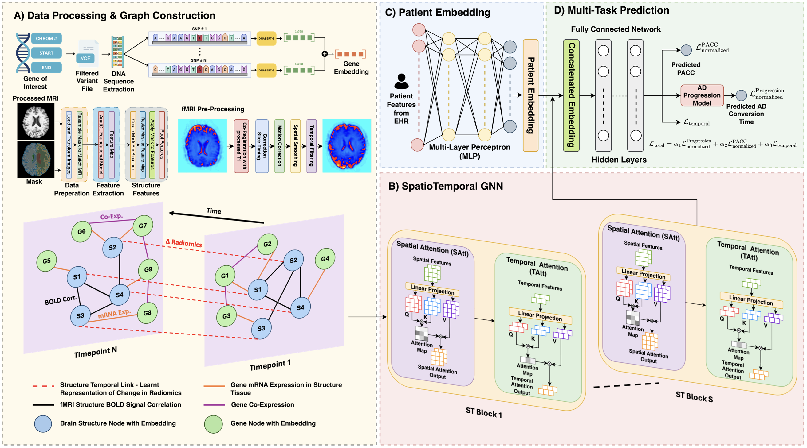

# 🧠 MAGNET-AD: Multitask Spatiotemporal GNN for Alzheimer's Prediction

## 📌 Overview

MAGNET-AD is a novel multitask spatiotemporal graph neural network (STGNN) designed to predict both the Preclinical Alzheimer's Cognitive Composite (PACC) score and time to AD conversion. It achieves state-of-the-art performance by integrating multimodal data and capturing the complex interplay of biological, structural, and temporal factors in preclinical Alzheimer's Disease.

This repository contains the official inference code for the MAGNET-AD (Multitask Spatiotemporal GNN for Interpretable Prediction of PACC and Conversion Time in Preclinical Alzheimer) framework.


## 🏗️ Architecture



The framework consists of four key components:

1. 🧩  **Hybrid Data Fusion** : Integrates dynamic neuroimaging patterns with time-invariant genetic markers through weighted edges
2. ⏱️  **Dual Attention Mechanisms** : Employs spatial attention for relationships between brain structures and genetic factors, and temporal attention for structural changes across visits
3. 📊  **Multi-Task Learning** : Simultaneously predicts PACC scores and AD conversion time through specialized prediction heads
4. 📈  **Temporal Importance Weighting** : Adaptively learns critical time points in disease progression using an innovative loss function

## 🛠️ Installation

Ensure you have the required dependencies installed:

```python
# Create Environment
conda create -n magnetad python=3.9
# Activate Environment
conda activate magnetad
# Clone Repo
git clone https://github.com/salmasoma/MAGNET-AD/
cd MAGNET-AD
# Install requirements
pip install -r requirements.txt
```

## 🚀 Usage

### Generate brain graphs separately:

```python
python generate_graphs.py \
  --embeddings_dir "/path/to/structure_embeddings" \
  --correlation_path "/path/to/bold_correlations.csv" \
  --clinical_data "/path/to/clinical_data.csv" \
  --gene_gene_path "/path/to/gene_gene.csv" \
  --gene_structure_path "/path/to/gene_structure.csv" \
  --gene_embeddings_dir "/path/to/gene_embeddings" \
  --output_dir "./brain_graphs" \
  --bold_thresholds 50 70 90 100\
  --create_splits
```

### Run inference on pre-generated graphs:<pre><div class="relative flex flex-col rounded-lg"><div class="text-text-300 absolute pl-3 pt-2.5 text-xs"></div></div></pre>

```python
python simple_inference.py \
  --model_path "/path/to/trained_model.pt" \
  --data_dir "./brain_graphs" \
  --csv_file "/path/to/clinical_data.csv" \
  --output_file "./results/predictions.pkl" \
  --bold_threshold 100
```

### Generate graphs and run inference on patient data:

<pre><div class="relative flex flex-col rounded-lg"><div class="text-text-300 absolute pl-3 pt-2.5 text-xs"></div></div></pre>


```python
python complete_workflow.py \
  --model_path "models/magnetad_model.pt" \
  --embeddings_dir "/path/to/structure_embeddings" \
  --correlation_path "/path/to/bold_correlations.csv" \
  --clinical_data "/path/to/clinical_data.csv" \
  --gene_gene_path "/path/to/gene_gene.csv" \
  --gene_structure_path "/path/to/gene_structure.csv" \
  --gene_embeddings_dir "/path/to/gene_embeddings" \
  --output_dir "./results" \
  --verbose
```
